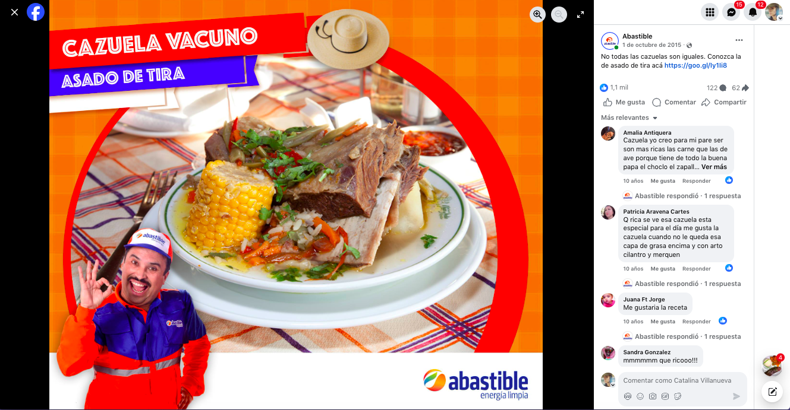

markdown
# Viral Content Examples

## Most Successful Posts

### 🏆 "Chilean Knows" Campaign
**825,000 reach** | **45,000 reactions** | **12,000 shares**

### 🍲 Traditional Chilean Stew Campaign

**850,000 reach** | **High engagement** | **Cultural authenticity**

*"Not all stews are the same. Discover our traditional rib stew recipe here."*

*Campaign highlighting authentic Chilean cuisine that achieved massive organic reach through cultural relevance.*

### 🔥 "Neighborhood Traditions"  
**620,000 reach** | **38,000 comments** | **8,500 shares**

markdown
### 👵 "We Love Our Grandmas" Campaign

**Cultural relevance** | **Family values** | **Emotional storytelling**

*Example of our authentic Chilean family content that built deep community connections.*

markdown
### 🎂 Traditional Chilean Meringue Cake

**Who's guilty of leaving lipstick marks on our cheeks? Our lovely and adorable grandmas. Share this image if you love grandmothers' affection!**
**2,000+ likes** | **High engagement** | **Cultural content**

*Example of authentic recipe content I personally wrote, showcasing traditional Chilean cuisine that resonated deeply with our community.*

### 🍲 Traditional Chilean Stew Campaign

**850,000 reach** | **High engagement** | **Cultural authenticity**

*"Not all stews are the same. Discover our traditional rib stew recipe here."*

*Campaign highlighting authentic Chilean cuisine that achieved massive organic reach through cultural relevance.*

## Why This Worked
- Cultural relevance to Chilean identity
- Emotional storytelling with real people
- Authentic visual style
- Family and generational connections

[← Back to Main Page](../README.md)
